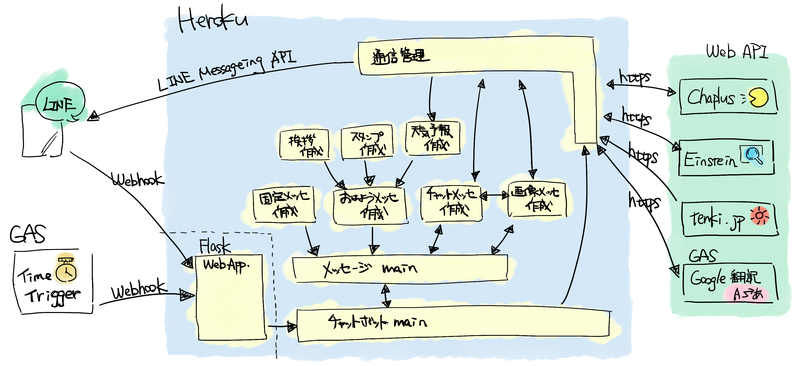
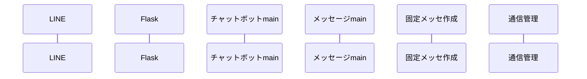
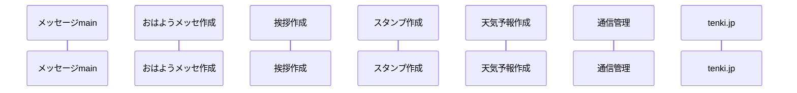
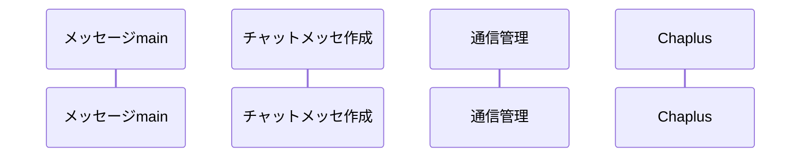
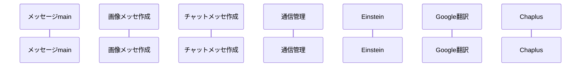

mermaid.jsによるシーケンス図を使用しているため、拡張機能などでmarkdownのmermaid.jsに対応していない方は、[こちら]()を参照してください。

# 内部設計仕様書  

本書では、AIのI/F詳細および機能詳細の説明を行う。  

## I/F概要  

以下に、I/Fの概要図を示す。  
本システムは「LINE」、「Heroku」、「WebAPI」より構成されている。  
また、Heroku内に記載されている四角で囲った機能は、それに対応したファイルに分割されている。  
データ詳細が記載されていない矢印は、次のセクションより説明する。  

Fig. I/F概要図  

### LINEから受信するデータ  

LINEからはユーザのメッセージをHeroku上に立ち上げたWebアプリケーションにWebhookする。  
以下のリンクを参照して、LINE Developersに登録後、LINE Botを作成。  
Webhookの設定を行う。  
[LINE Botの作成方法](https://developers.line.biz/ja/docs/messaging-api/building-bot/#set-up-bot-on-line-developers-console)  
受信したデータは、「固定メッセージ」、「チャットメッセージ」、「画像メッセージ」に使用される。  

### Time Triggerから受信するデータ  

Time Triggerからは定時実行されるトリガをHeroku上に立ち上げたWebアプリケーションにWebhookする。 
受信したデータは、「おはようメッセージ」に使用される。 

### 通信管理(Heroku)から送信するデータ  

通信管理では、WebAPIへのアクセスおよびLINEへのメッセージ返信を行う。  
WebAPIへはhttp通信を行い結果を受信する。  
受信したデータは「おはようメッセージ」「チャットメッセージ」、「画像メッセージ」に使用される。  
LINEへはLINE Bot APIを用いてメッセージ返信を行う。  

## 固定メッセージ  

本章では、固定メッセージのI/F詳細及び変数定数詳細の説明を行う。  

### I/F詳細  

I/F詳細を以下に示す。  
シーケンス図内のプロセス名はFig. I/F概要図に対応している。  
また、「LINE」→「チャットボットmain」までの通信および、「チャットボットmain」→「通信管理」→「LINE」のデータの流れは同じである。  
そのため、「おはようメッセージ」および「チャットメッセージ」、「画像メッセージ」では共通部分を省略する。  

Fig. 固定メッセージのI/F詳細  

## おはようメッセージ  

本章では、おはようメッセージのI/F詳細及び変数定数詳細の説明を行う。  

### I/F詳細  

I/F詳細を以下に示す。  
シーケンス図内のプロセス名はFig. I/F概要図に対応している。  

Fig. おはようメッセージのI/F詳細  

## チャットメッセージ  

本章では、チャットメッセージのI/F詳細及び変数定数詳細の説明を行う。  

### I/F詳細  

I/F詳細を以下に示す。  
シーケンス図内のプロセス名はFig. I/F概要図に対応している。  

Fig. チャットメッセージのI/F詳細  

## 画像メッセージ  

本章では、画像メッセージのI/F詳細及び変数定数詳細の説明を行う。  

### I/F詳細  

I/F詳細を以下に示す。  
シーケンス図内のプロセス名はFig. I/F概要図に対応している。  

Fig. 画像メッセージのI/F詳細  

## Web API 詳細  

WebAPIの使用方法を以下に示す。  

### Chaplus  

### Einstein  

### tenki.jp  

### Google翻訳